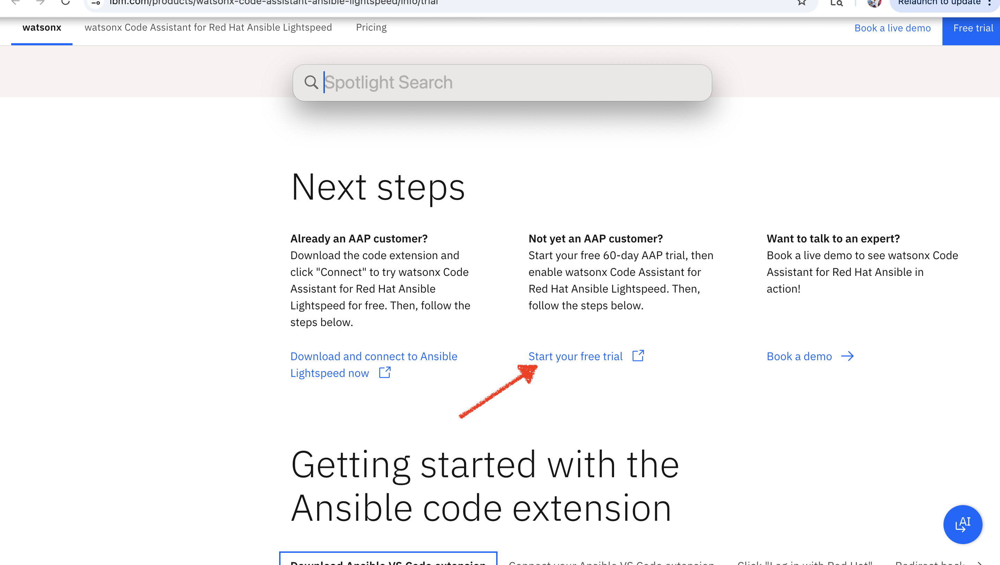
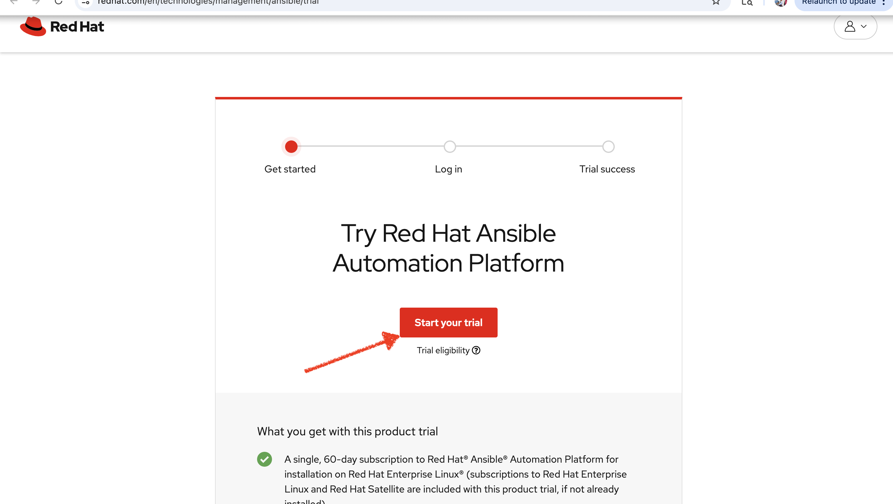
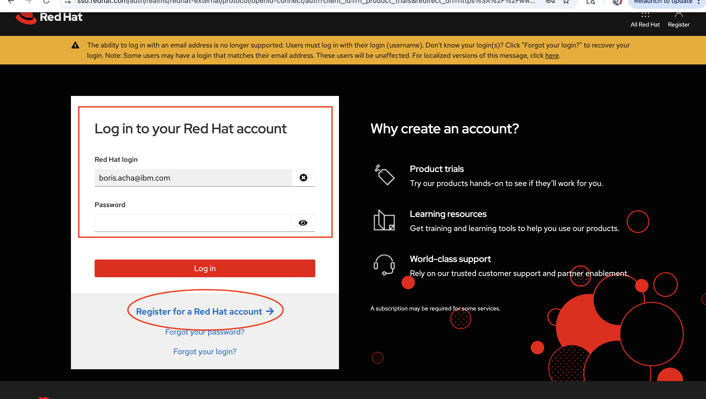
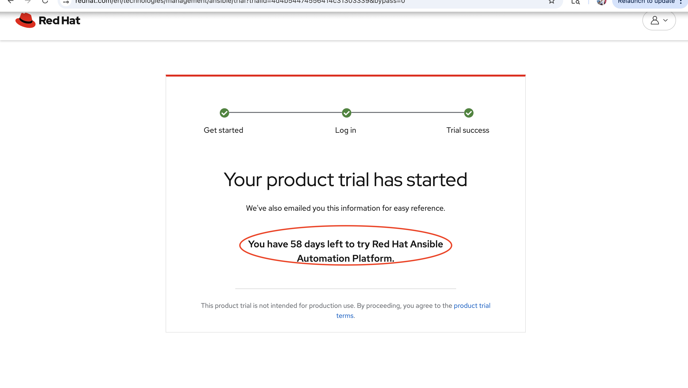
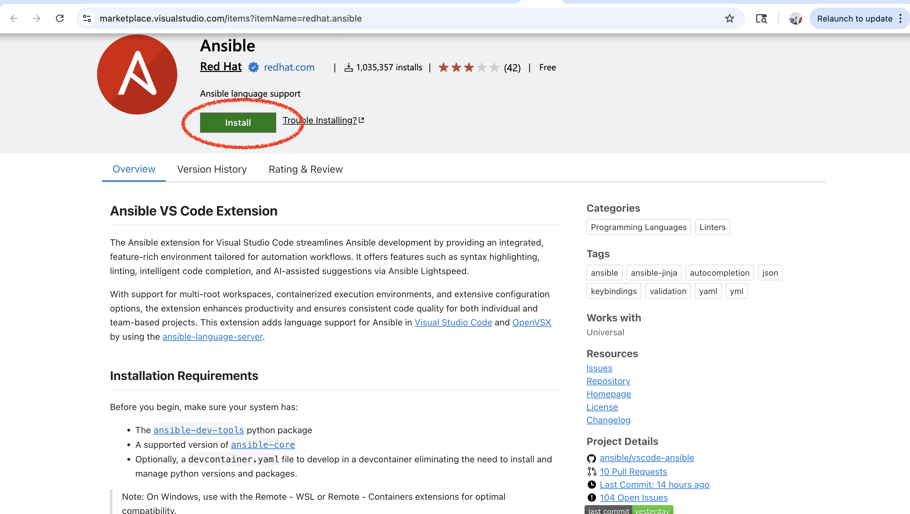
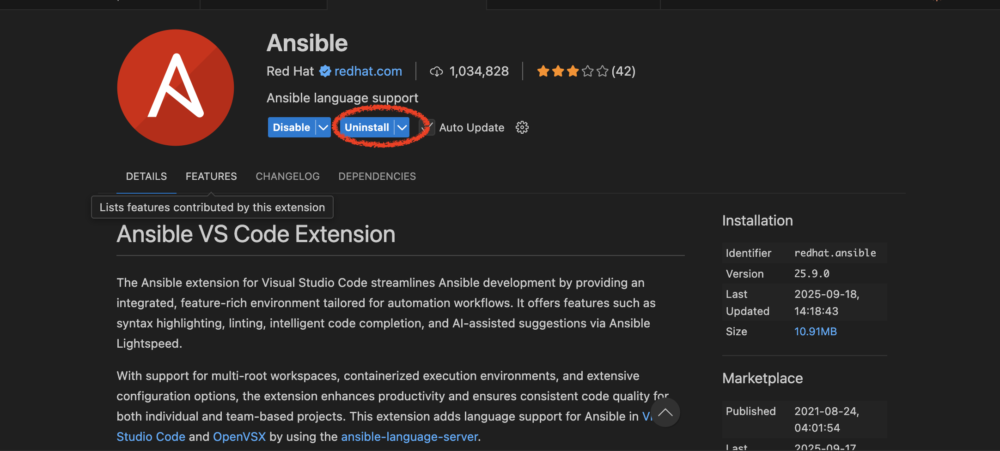
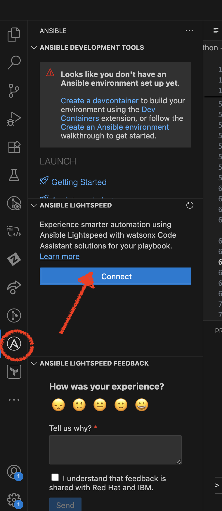
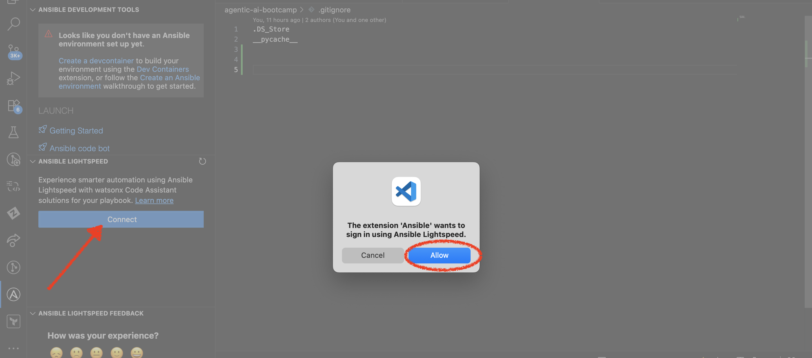
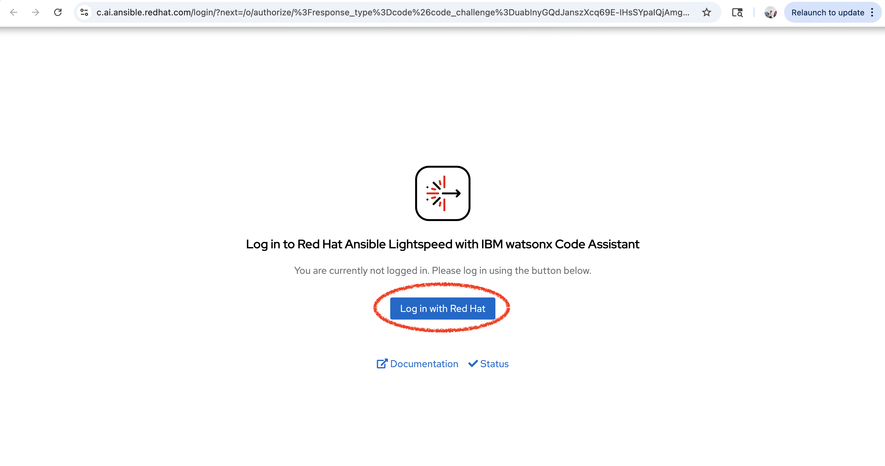
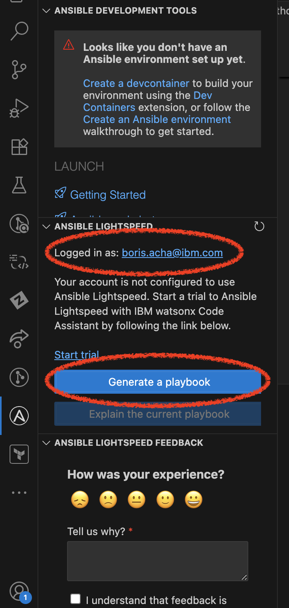

# KeyBank Hackathon - IBM watsonx Code Assistant for Ansible

Welcome to the KeyBank Hackathon! This hands-on workshop will introduce you to **IBM watsonx Code Assistant for Red Hat Ansible Lightspeed**, an AI-powered tool that helps you create Ansible playbooks using natural language prompts.

---

## 📑 Table of Contents

### Pre-Hackathon Setup
1. [What You'll Learn](#1-what-youll-learn)
2. [Getting Started - Environment Setup](#2-getting-started---environment-setup)
   - [2.1 Create Your Red Hat Ansible Lightspeed Trial Account](#21-create-your-red-hat-ansible-lightspeed-trial-account)
   - [2.2 Install Git](#22-install-git)
   - [2.3 Install Visual Studio Code](#23-install-visual-studio-code)
   - [2.4 Clone the Hackathon Repository](#24-clone-the-hackathon-repository)
   - [2.5 Install the Red Hat Ansible Extension](#25-install-the-red-hat-ansible-extension)
   - [2.6 Connect to Ansible Lightspeed](#26-connect-to-ansible-lightspeed)
   - [2.7 Verify Your Setup & Pre-Hackathon Checklist](#27-verify-your-setup--pre-hackathon-checklist)

### Hackathon Exercises
3. [Workshop Exercises](#3-workshop-exercises)

---

## 1. 📋 What You'll Learn

- How to use AI to generate Ansible tasks and playbooks
- Single-task and multi-task generation with Ansible Lightspeed
- Best practices for writing Ansible playbooks with AI assistance
- Hands-on experience configuring Apache web servers using AI-generated code

---

## 2. 🚀 Getting Started - Environment Setup

### 2.1 Create Your Red Hat Ansible Lightspeed Trial Account

Before the hackathon, you **MUST** complete the following setup steps:

1. Visit the trial registration page:
   **https://www.ibm.com/products/watsonx-code-assistant-ansible-lightspeed/info/trial**

2. Click on **"Start your free trial"**

   

3. You will be directed to the Red Hat trial registration page. Click on the red **"Start Your Trial"** button to begin.

   

   **Note:** To start this no-cost product trial, you must:
   - Have a Red Hat account (you'll be prompted to create one if you don't have one)
   - Accept the product trial terms and conditions
   - If you have previously activated this trial, you must wait at least 90 days from the last expiration date to start again

4. **Sign in** with your Red Hat credentials or **Register** for a new Red Hat account if you don't have one.

   

5. Once registration is complete, you will see a welcome message confirming your trial activation.

   

   **✅ Trial account created!** You now have a 60-day subscription to Red Hat® Ansible® Automation Platform with Lightspeed.

---

### 2.2 Install Git

**Git** is required to clone the hackathon repository. Follow the instructions for your operating system:

#### For Windows:

1. Download Git from: **https://git-scm.com/download/win**
2. Run the installer
3. During installation, accept the default settings (recommended)
4. Click **Install** and wait for completion
5. **Verify installation**: Open Command Prompt and type:
   ```
   git --version
   ```
   You should see something like `git version 2.x.x`

#### For macOS:

1. Open **Terminal** (Applications → Utilities → Terminal)
2. Type the following command and press Enter:
   ```
   git --version
   ```
3. If Git is not installed, macOS will prompt you to install it automatically
4. Follow the prompts to install **Command Line Developer Tools**
5. Once installed, verify by typing `git --version` again

#### For Linux:

1. Open Terminal
2. Install Git using your package manager:
   - **Ubuntu/Debian**: `sudo apt-get install git`
   - **Fedora**: `sudo dnf install git`
   - **CentOS**: `sudo yum install git`
3. Verify installation: `git --version`

---

### 2.3 Install Visual Studio Code

1. Download and install **Visual Studio Code** for your operating system:
   **https://code.visualstudio.com/download**

2. Choose the appropriate version:
   - **Windows** - Download and run the installer
   - **macOS** - Download the .dmg file and drag to Applications
   - **Linux** - Follow the instructions for your distribution

3. Launch Visual Studio Code after installation completes.

---

### 2.4 Clone the Hackathon Repository

Now you'll clone the hackathon repository directly into VS Code.

**Step 1: Open VS Code**

1. Launch **Visual Studio Code**

**Step 2: Open the Command Palette**

1. Click **View** → **Command Palette** (or press `Cmd+Shift+P` on Mac, `Ctrl+Shift+P` on Windows/Linux)
2. Type: `Git: Clone`
3. Select **Git: Clone** from the dropdown

**Step 3: Enter the Repository URL**

1. Paste this URL into the input box:
   ```
   https://github.com/baacha123/keybank-hakathon.git
   ```
2. Press **Enter**

**Step 4: Choose a Location**

1. A file browser will appear
2. Navigate to where you want to save the repository (e.g., **Desktop** or **Documents**)
3. Click **Select as Repository Destination** (or **Select Repository Location**)

**Step 5: Open the Repository**

1. VS Code will clone the repository (this may take a minute)
2. When prompted **"Would you like to open the cloned repository?"**, click **Open**
3. The repository folder will open in VS Code

**Step 6: Verify the Clone**

1. In the **left sidebar** (Explorer panel), you should see:
   - `README.md`
   - `images/` folder
   - `watsonx-code-assistant-for-ansible/` folder

**✅ Success!** You now have all the hackathon exercise files on your computer!

---

### 2.5 Install the Red Hat Ansible Extension

1. Open the Ansible extension marketplace page:
   **https://marketplace.visualstudio.com/items?itemName=redhat.ansible**

2. Click on the **Install** button on the webpage.

   

3. Your browser will prompt you to **Open Visual Studio Code**. Click **Continue** or **Open** to proceed.

4. VS Code will open and begin installing the Red Hat Ansible extension automatically.

5. Click **Install** in VS Code to confirm the installation.

   

6. Wait for the installation to complete. You can learn more about the extension here:
   https://marketplace.visualstudio.com/items?itemName=redhat.ansible

---

### 2.6 Connect to Ansible Lightspeed

**Step 1: Find the Ansible Extension**

1. Once the plugin is installed, look for the **Ansible icon** in the left sidebar panel of VS Code.

2. Click on the Ansible icon to open the Ansible panel.

   

**Step 2: Connect to Lightspeed Service**

3. In the Ansible panel, click the **Connect** button.

   

4. A popup will appear asking for permission to open an external website. This will redirect you to authenticate with your Red Hat trial credentials.

   

5. Click **Open** to continue to the authentication page.

**Step 3: Authenticate with Red Hat**

6. On the authentication page, click **"Login with Red Hat"**.

   

7. Log in using the **Red Hat credentials** you created in Step 1 for your 60-day trial.

8. After logging in, click **Authorize** to grant VS Code access to Ansible Lightspeed.

**Step 4: Verify Connection**

9. After clicking **Authorize**, you will be redirected back to VS Code.

   

10. In the Ansible panel, you should now see:
    - Your Red Hat username
    - The **"Generate Playbook"** button
    - A **"Lightspeed"** indicator in the bottom-right corner of VS Code

**✅ Success!** You are now connected and ready to start generating Ansible playbooks with AI assistance.

---

### 2.7 Verify Your Setup & Pre-Hackathon Checklist

✅ **Complete by EOD October 20th, 2024:**

Please ensure all of the following are completed before the hackathon:

- [ ] **Git** installed on your laptop
- [ ] **Visual Studio Code** installed on your laptop
- [ ] **Hackathon repository** cloned from GitHub
- [ ] **Red Hat trial account** created and activated (60-day subscription)
- [ ] **Email sent** to workshop organizers confirming registration completion
- [ ] **Red Hat Ansible extension** installed in VS Code
- [ ] **Ansible Lightspeed** connected and authenticated
- [ ] **"Lightspeed" indicator** visible in the bottom-right corner of VS Code
- [ ] **"Generate Playbook" button** visible in the Ansible panel

**Having issues?** Contact the workshop organizers for assistance before the hackathon day.

---

## 3. 📚 Workshop Exercises

During the hackathon, you will complete hands-on exercises using IBM watsonx Code Assistant for Ansible Lightspeed. We'll start with a simple warm-up exercise, then move to a comprehensive Apache web server deployment.

